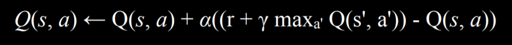

# Nim

Requirements: [https://cs50.harvard.edu/ai/2020/projects/4/nim/](https://cs50.harvard.edu/ai/2020/projects/4/nim/)

> The project implements an AI opponent in the game of [Nim](https://en.wikipedia.org/wiki/Nim). This is done with reinforcement learning, specifically Q-learning. 

The AI plays against itself repeatedly, learning from experience. A reward value is calculated for every `(state, action)` pair, which signifies a specific state of the game and action that can be taken in that state.

## Logic

The formula for Q-learning is as follows:

Simplified for this application the formula is as follows:

`Q(s, a) <- Q(s, a) + alpha * (new value estimate - old value estimate)`

An epsilon value of `0.1` is also specified to introduce a measure of randomness, where the best action is not necessarily taken.
