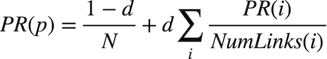

# PageRank
*by Matthew Bishop*

Requirements: [https://cs50.harvard.edu/ai/2020/projects/2/pagerank/](https://cs50.harvard.edu/ai/2020/projects/2/pagerank/)

The project requires the implementation of a PageRank algorithm to rank webpages according to how important they are. In this case this is determined by how many other pages link to the relevant page, taking into account how important the other pages are.

Two implementations are done: a random surfer model akin to a Markov Chain, and an iterative algorithm that eventually converges.

A damping factor `d` is used to ensure that all pages in the corpus can be reached.