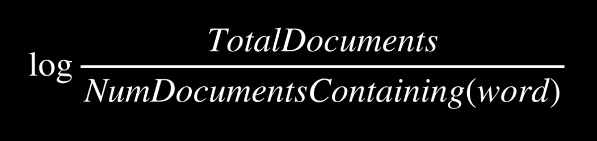

# Questions
*by Matthew Bishop*

Requirements: [https://cs50.harvard.edu/ai/2020/projects/6/questions/](https://cs50.harvard.edu/ai/2020/projects/6/questions/)  

This project relates to natural language processing and functions as a question answering system. Document and passage retrieval is implemented, whereby the system has access to a corpus of text documents. 

The most relevant document is identified to the user's query whereafter the most relevant passage in the document is determined.

## Process

To find the most relevant documents, tf-idf is used to rank documents based on term frequency for words in the query as well as inverse document frequency.

To find the most relevant passage, a combination of inverse document frequency and a query term density measure is used.

The formula for inverse document frequency is as follows:

This formula is combined (i.e. multiplied) with term frequency.