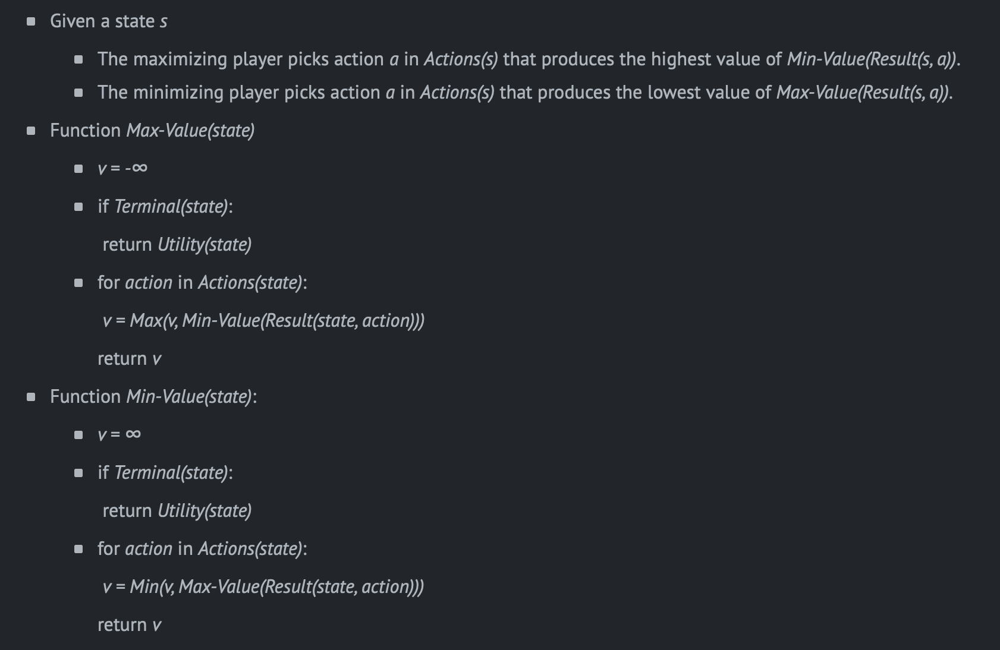
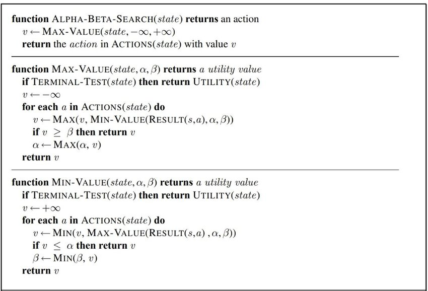

# Tic Tac Toe
*by Matthew Bishop*

Requirements: [https://cs50.harvard.edu/ai/2020/projects/0/tictactoe/](https://cs50.harvard.edu/ai/2020/projects/0/tictactoe/)

The project requires the implementation of functionality to play Tic Tac Toe against an AI. This is done in the form of a minimax algorithm and is optomised with alpha beta pruning. The psuedocode for these methods are shown below. Unit tests are also written to ensure correct functionality of all implemented functions.

## Minimax algorithm

## Alpha Beta Pruning

